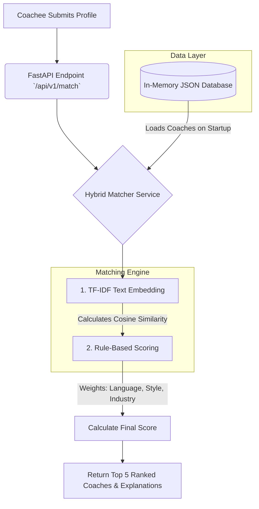

# Coach-Coachee Matchmaking Recommendation Engine

## 🏗️ Architecture Overview

The system is built as a highly responsive API using **FastAPI**. It leverages a hybrid matching engine that combines fast rule-based filtering with machine learning text embeddings (`scikit-learn` TF-IDF) to find the absolute best coach for a coachee.



## 🧠 Approach Used

I constructed a **Hybrid Matching Engine**. 
1. **Machine Learning (Embeddings):** Instead of just looking for exact keyword matches, I used `scikit-learn`'s `TfidfVectorizer` to convert Coachee goals and Coach expertise into mathematical vectors. This allows the system to find semantic similarities between what a coachee wants and what a coach offers.
2. **Rule-Based Weights:** Certain criteria act as heavy multipliers or hard requirements. For example, language compatibility is weighed heavily, and coaching style preferences are treated as critical categorical matches.

## ⚖️ Key Design Decisions & Trade-offs

* **TF-IDF over Large Language Models (LLMs):** 
  * *Reason:* While OpenAI embeddings or LLMs act as great rankers, they introduce severe network latency (often 2-5 seconds per API call) and high costs. TF-IDF calculates text similarity mathematically locally in less than `10ms`.
  * *Trade-off:* We lose some deep semantic understanding of long paragraphs, but for short phrases (like "System Design", "Agile"), TF-IDF is more than powerful enough while guaranteeing sub-second response times.
* **In-Memory Data Loading:** 
  * *Reason:* To hit the 5-10 second speed requirement for 10,000 users, I chose to read the data into memory upon server startup.
  * *Trade-off:* Fast reads, but it requires server restarts to load new coaches. (See Scalability below for the production fix).
* **Explainability First:** The engine returns an `explanation` object detailing exactly *why* points were awarded (e.g. "Matches preferred coaching style"). This creates trust in the AI for the end-user.

## 🚀 Scalability Considerations (Scaling to 100,000+ Users)

While the current system computes matrices in milliseconds and easily handles 10,000 coaches, scaling to 100,000+ users and millions of daily matches requires architectural upgrades:
1. **Migrate to a Vector Database:** We would move the TF-IDF / Embedding arrays out of RAM and into a specialized Vector Database (like **FAISS**, **Milvus**, or **Pinecone**). These DBs use Approximate Nearest Neighbor (ANN) algorithms to search millions of records instantly.
2. **Persistent SQL Database:** Moving from `coaches.json` to **PostgreSQL**. This ensures ACID compliance when coaches frequently update their profiles or when thousands of users register concurrently.
3. **Caching Layer:** Introducing **Redis** to cache identical queries (e.g., if many junior engineers search for the exact same "Agile" and "System Design" skills, we can return the cached Top 5 instantly without hitting the matching engine).

## 💻 Setup Instructions

This project runs locally in a Python environment.

1. **Create and Activate a Virtual Environment:**
   ```bash
   python -m venv venv
   # On Windows:
   .\venv\Scripts\activate
   # On Mac/Linux:
   source venv/bin/activate
   ```
2. **Install Dependencies:**
   ```bash
   pip install -r requirements.txt
   ```
3. **Run the Application:**
   ```bash
   python run.py
   ```
4. **Test the API:**
   Open your browser and navigate to: [http://localhost:8000/docs](http://localhost:8000/docs)
   Use the `POST /api/v1/match` endpoint to simulate a Coachee payload.

*(Optional)*: Run `python generate_data.py` to automatically generate 100 fresh coaches into the database!

## ⏱️ Approximate Time Spent
**~4 Hours** (Including system design planning, algorithm fine-tuning, and writing documentation).
